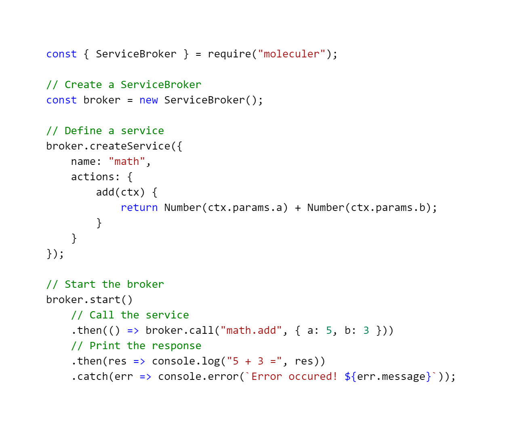
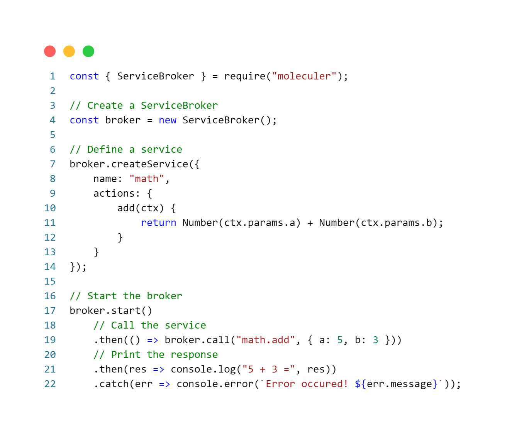
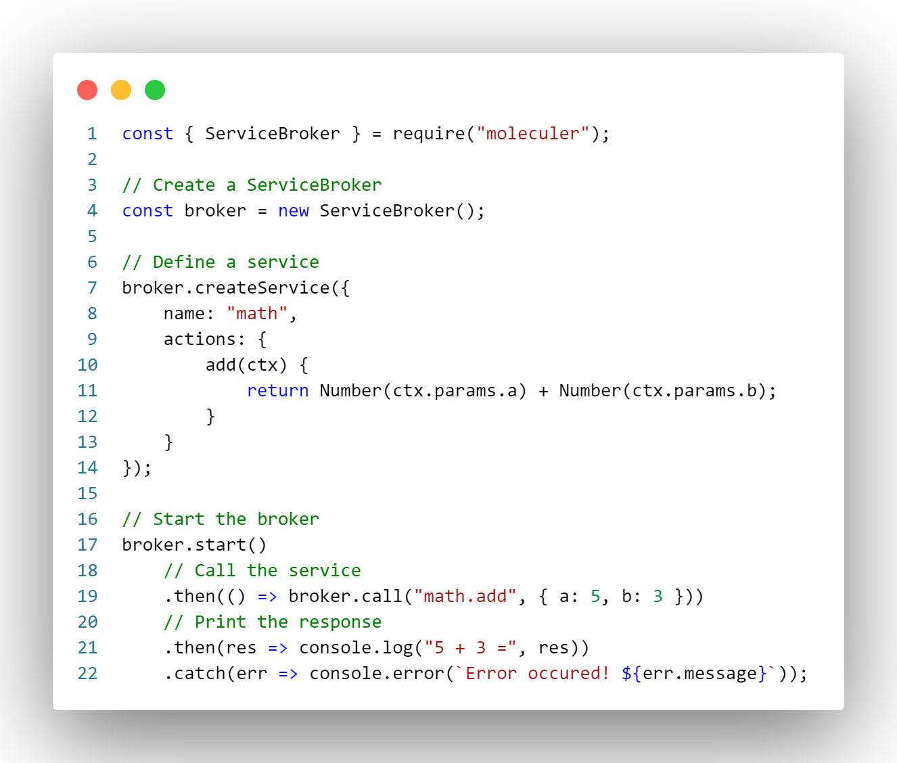
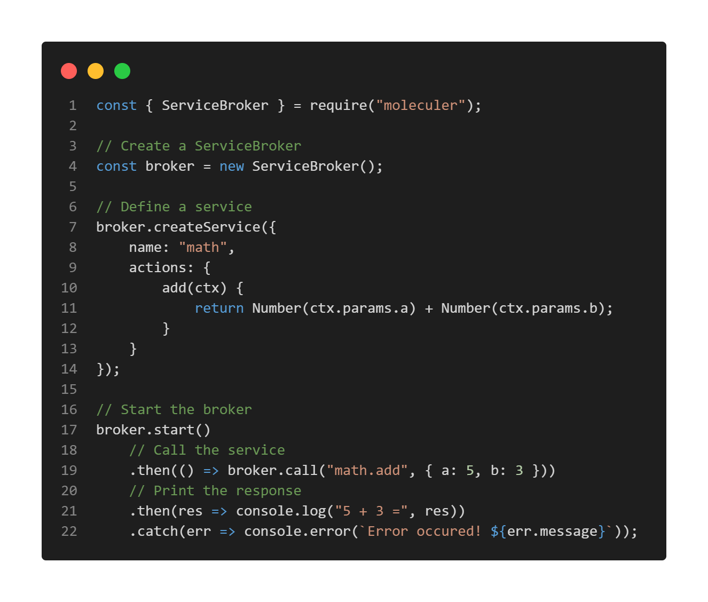

# CodeSnap
📸 Take beautiful screenshots of your code in VS Code!

## Usage Instructions
1. Open the command palette (Ctrl+Shift+P on Windows and Linux, Cmd+Shift+P on OS X) and search for CodeSnap.
2. Select the code you'd like to screenshot.
3. Adjust the width of the screenshot if desired.
4. Click the shutter button to save the screenshot to your disk.

